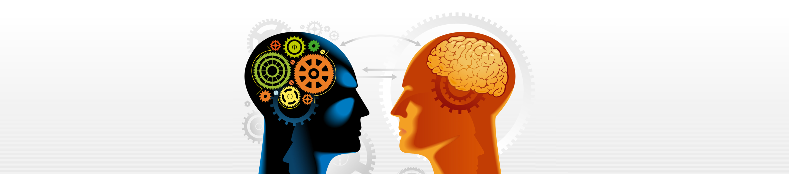
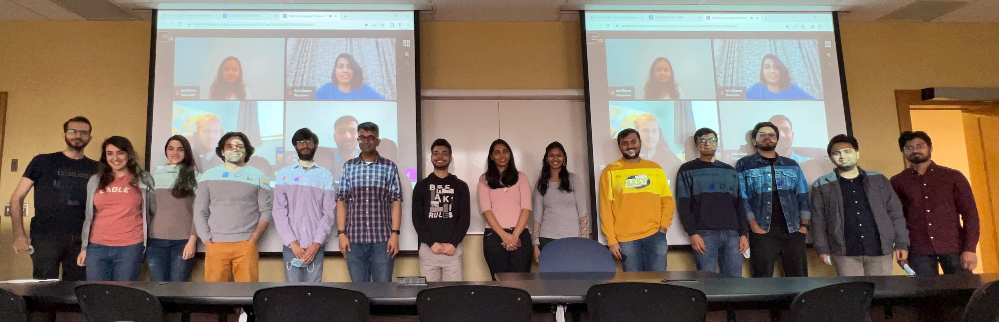

Image Source: https://unanimous.ai/chat-with-a-different-kind-of-artificial-intelligence

# 2022: Natural Language Communication 
Materials for the Computer Science course "[Natural Language Processing & Understanding](./Course_Syllabus.pdf)" with a focus on Social Media (Social Network Analysis)

# W2022: Last Week 

By Soroush's Phone

## License
©2021. All materials available here are licensed under a [CC BY-NC-SA 4.0](LICENSE.txt) license. 
